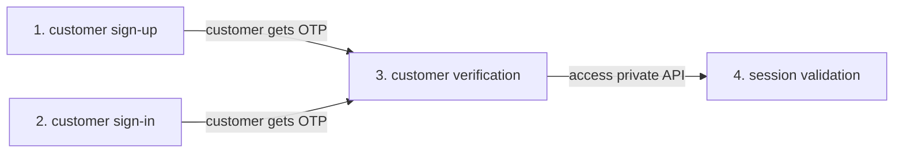
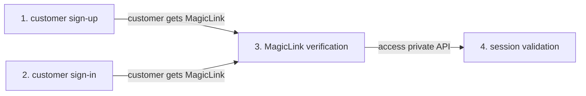

# Descope Node.js SDK

Use the Descope NodeJS SDK for NodeJS/Express to quickly and easily add user authentication to your application or website. If you need more background on how the ExpresSDKs work, [click here](/sdk/index.mdx). 


## ExpressStart with OTP Authentication

This section will show you how to implement user authentication using a one-time password (OTP). A typical four step flow for OTP authentictaion is shown below.



### Prerequisites

Replace any instance of  `<ProjectID>` in the code below with your company's Project ID, which can be found in the [Descope console](https://app.descope.com).

* Run the following commands in your project

     These commands will add the Descope NodeJS SDK as a project dependency.

     ```bash
    npm i --save @descope/node-sdk
     ```

* Import and initialize the ExpresSDK for NodeJS client in your source code

    ```javascript
    import DescopeClient from '@descope/node-sdk';
    const descopeClient = DescopeClient({ projectId: <ProjectID> });
    ```
or

    ```javascript
    const sdk = require('@descope/node-sdk');
    const descopeClient = sdk({ projectId: <ProjectID> });
    ```

### 1. Customer Sign-up

In your sign-up route for OTP (for example, `myapp.com/signup`) generate a sign-up request and send the OTP verification code via the selected delivery method. In the example below an email is sent to "mytestmail@test.com". In additon, optional user data (for exmaple, a custom username in the code sample below) can be gathered during the sign-up process.

```javascript
await descopeClient.otp.signUp.email("mytestmail@test.com");
```

### 2. Customer Sign-in
In your sign-in route for OTP (for exmaple, `myapp.com/login`) generate a sign-in request send the OTP verification code via the selected delivery method. In the example below an email is sent to "mytestmail@test.com".

```javascript
await descopeClient.otp.signIn.email("mytestmail@test.com");
```

### 3. Customer Verification

In your verify customer route for OTP (for example, `myapp.com/verify`) verify the OTP from either a customer sign-up or sign-in. The VerifyCode function call will write the necessary tokens and cookies to the response writer (`w`), which will be used by the NodeJS client to validate each session interaction.

```javascript
const out = await descopeClient.otp.verify.email(identifier, code);
if (out.data.cookies) {
    res.set('Set-Cookie', out.data.cookies);
}
```

### 4. Session Validation

Session validation checks to see that the visitor to your website or application is who they say they are, by comparing the value in the validation variables against the session data that is already stored.

```javascript
const out = await descopeClient.validateSession(session_jwt, refresh_jwt);
if (out?.cookies) {
    res.set('Set-Cookie', out.cookies);
}
```

## ExpressStart with MagicLink Authentication

This section will help you implement user authentication using Magiclinks. A typical four step flow for OTP authentictaion is shown below.



### Prerequisites

Replace any instance of  `<ProjectID>` in the code below with your company's Project ID, which can be found in the [Descope console](https://app.descope.com).

* Run the following commands in your project

     These commands will add the Descope NodeJS SDK as a project dependency.

     ```bash
    npm i --save @descope/node-sdk
     ```

* Import and initialize the ExpresSDK for NodeJS client in your source code

    ```javascript
    import DescopeClient from '@descope/node-sdk';
    const descopeClient = DescopeClient({ projectId: <ProjectID> });
    ```
or

    ```javascript
    const sdk = require('@descope/node-sdk');
    const descopeClient = sdk({ projectId: <ProjectID> });
    ```

### 1. Customer Sign-up

In your sign-up route using magic link (for example, `myapp.com/signup`) generate a sign-up request and send the magic link via the selected delivery method. In the example below an email is sent to "mytestmail@test.com" containing the magic link and the link will automatically return back to the provided URL ("https://mydomain.com/verify"). In additon, optional user data (for exmaple, a custom username in the code sample below) can be gathered during the sign-up process.

```javascript
await descopeClient.magiclink.signUp.email("mytestmail@test.com", { name: "custom name" })
```

### 2. Customer Sign-in
In your sign-in route using magic link (for exmaple, `myapp.com/login`) generate a sign-in request send the magic link via the selected delivery method. In the example below an email is sent to "mytestmail@test.com" containing the magic link and the link will automatically return back to the provided URL ("https://mydomain.com/verify"). 

```javascript
await descopeClient.magiclink.signIn.email("mytestmail@test.com")
```

### 3. Customer Verification

In your verify customer route for magic link (for example, `mydomain.com/verify`) verify the token from either a customer sign-up or sign-in.

```javascript
const out = await descopeClient.magiclink.verify(token)
if (out.data.cookies) {
    res.set('Set-Cookie', out.data.cookies)
}
```

### 4. Session Validation

Session validation checks to see that the visitor to your website or application is who they say they are, by comparing the value in the validation variables against the session data that is already stored.

```javascript
const out = await descopeClient.validateSession(session_jwt, refresh_jwt)
if (out?.cookies) {
    res.set('Set-Cookie', out.cookies)
}
```

## ExpressStart with OAuth Authentication

In the example below, we assume using the Descope builtin oauth provider, in that case, we dont need to define any specific application details.

### Prerequisites

Replace any instance of  `<ProjectID>` in the code below with your company's Project ID, which can be found in the [Descope console](https://app.descope.com).

* Run the following commands in your project

     These commands will add the Descope NodeJS SDK as a project dependency.

     ```bash
    npm i --save @descope/node-sdk
     ```

* Import and initialize the ExpresSDK for NodeJS client in your source code

    ```javascript
    import DescopeClient from '@descope/node-sdk';
    const descopeClient = DescopeClient({ projectId: <ProjectID> });
    ```
or

    ```javascript
    const sdk = require('@descope/node-sdk');
    const descopeClient = sdk({ projectId: <ProjectID> });
    ```

* Make sure to set the return url to exchange in the Descope Oauth authentication methods settings or use the start first argument.

### 1. Customer Sign-up/Sign-In

In your OAuth start flow (for example, `myapp.com/login-with-facebook`) generate a url to redirect the user to. In the example below the login 

```javascript
const out = await descopeClient.oauth.start.facebook();
return out.data.url;
```

### 2. Customer Exchange

In your exchange for any of the oauth provider (for example, `mydomain.com/exchange`) verify the code from the provider by using the exchange method. 

```javascript
const code = req.query.code
const out = await descopeClient.oauth.exchnage(code);
if (out.data.cookies) {
    res.set('Set-Cookie', out.data.cookies);
}
```

### 4. Session Validation

Session validation checks to see that the visitor to your website or application is who they say they are, by comparing the value in the validation variables against the session data that is already stored.

```javascript
const out = await descopeClient.validateSession(session_jwt, refresh_jwt);
if (out?.cookies) {
    res.set('Set-Cookie', out.cookies);
}
```

## Run the Examples

Instantly run the end-to-end ExpresSDK for NodeJS examples, as shown below. The source code for these examples are in the folder [GitHub node-sdk/examples folder](https://github.com/descope/node-sdk/blob/main/examples).

### Prerequisites

Run the following commands in your project. Replace any instance of  `<ProjectID>` in the code below with your company's Project ID, which can be found in the [Descope console](https://app.descope.com).

This commands will add the Descope NodeJS SDK as a project dependency, clone the SDK repository locally, and set the `DESCOPE_PROJECT_ID`.

```code bash
git clone github.com/descope/node-sdk
export DESCOPE_PROJECT_ID=<ProjectID>
```

### Run an example

**TL;DR**: Run `npm run quick`

1. Run this command in the root of the project to build the examples.

    ```code bash
    npm i
    npm run build
    cd examples/es6
    npm i
    npm start
    ```

2. Run a specific example

    ```code bash
    npm i
    npm run build
    cd examples/commonjs
    npm i
    npm start
    ```

## License

The Descope ExpresSDK for Go is licensed for use under the terms and conditions of the [MIT license Agreement](https://github.com/descope/go-sdk/blob/main/LICENSE).

