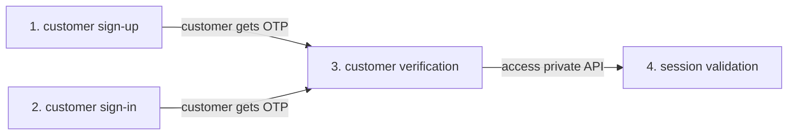

## OTP Authentication

This section will show you how to implement user authentication using a one-time password (OTP). A typical four step flow for OTP authentictaion is shown below.



### Prerequisites

Replace any instance of `<ProjectID>` in the code below with your company's Project ID, which can be found in the [Descope console](https://app.descope.com).

- Run the following commands in your project

  These commands will add the Descope NodeJS SDK as a project dependency.

  ```bash
  npm i --save @descope/node-sdk
  ```

- Import and initialize the ExpresSDK for NodeJS client in your source code

  ```javascript
  import DescopeClient from '@descope/node-sdk';
  const descopeClient = DescopeClient({ projectId: <ProjectID> });
  ```

  or

  ```javascript
  const sdk = require('@descope/node-sdk');
  const descopeClient = sdk({ projectId: <ProjectID> });
  ```

### 1. Customer Sign-up

In your sign-up route for OTP (for example, `myapp.com/signup`) generate a sign-up request and send the OTP verification code via the selected delivery method. In the example below an email is sent to "mytestmail@test.com". In additon, optional user data (for exmaple, a custom username in the code sample below) can be gathered during the sign-up process.

```javascript
await descopeClient.otp.signUp.email('mytestmail@test.com')
```

### 2. Customer Sign-in

In your sign-in route for OTP (for exmaple, `myapp.com/login`) generate a sign-in request send the OTP verification code via the selected delivery method. In the example below an email is sent to "mytestmail@test.com".

```javascript
await descopeClient.otp.signIn.email('mytestmail@test.com')
```

### 3. Customer Verification

In your verify customer route for OTP (for example, `myapp.com/verify`) verify the OTP from either a customer sign-up or sign-in. The VerifyCode function call will write the necessary tokens and cookies to the response writer (`w`), which will be used by the NodeJS client to validate each session interaction.

```javascript
const out = await descopeClient.otp.verify.email(identifier, code)
if (out.data.cookies) {
  res.set('Set-Cookie', out.data.cookies)
}
```

### 4. Session Validation

Session validation checks to see that the visitor to your website or application is who they say they are, by comparing the value in the validation variables against the session data that is already stored.

```javascript
const out = await descopeClient.validateSession(session_jwt, refresh_jwt)
if (out?.cookies) {
  res.set('Set-Cookie', out.cookies)
}
```
